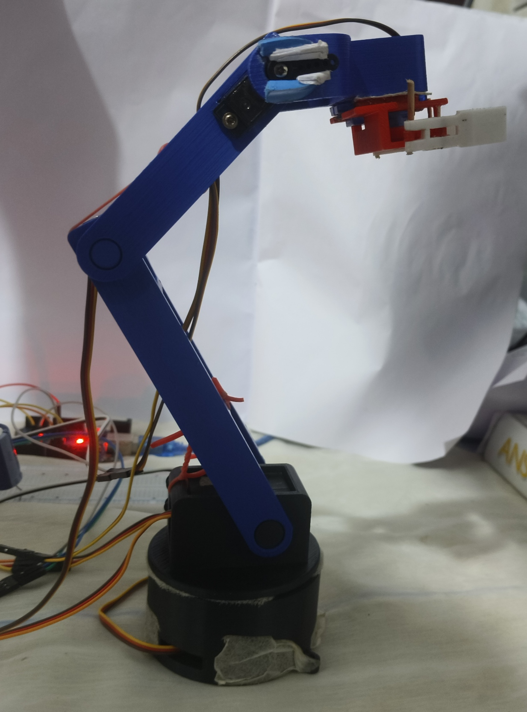
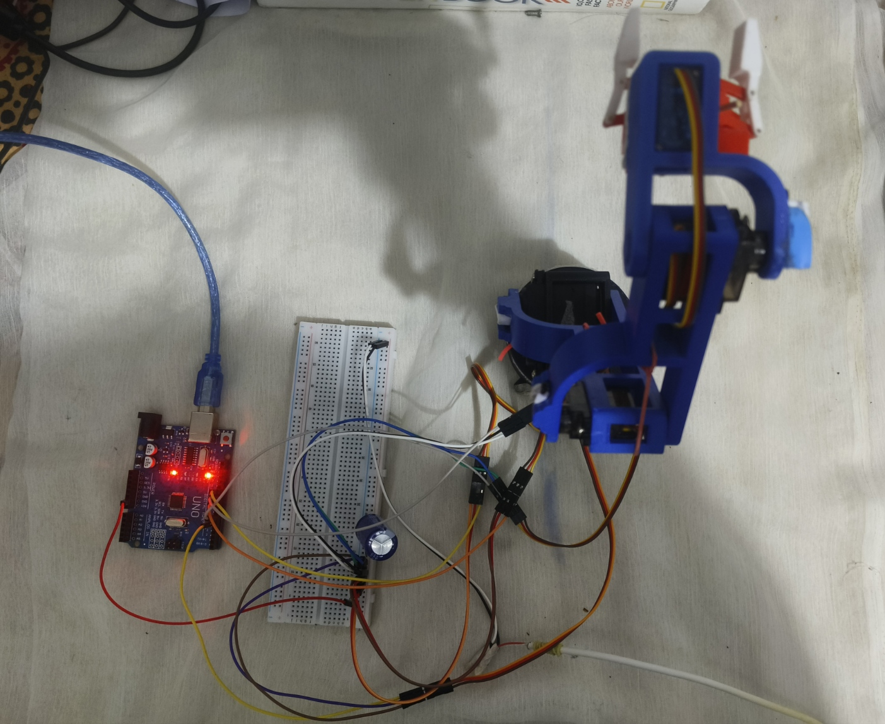

# vision-guided-4dof-arm
# Autonomous 4-DOF Vision-Guided Robotic Sorting Manipulator

<p align="center">
  
  
</p>

An end-to-end mechatronics and computer vision project implementing a closed-loop robotic sorting system. The pipeline integrates real-time color-space object tracking, analytical geometric inverse kinematics, an asynchronous serialization handshake, and a custom 3D-printed physical manipulator.

---

## 🏗️ System Architecture & Workflow
1. **Perception:** A camera feed tracks target coordinates (Green, Yellow, Red) using OpenCV HSV threshold filters.
2. **Kinematics:** A 2D pixel coordinate is converted into a physical radial distance ($R$) and angular heading ($\theta$). An analytical 3-DOF planar geometric Inverse Kinematics (IK) solver calculates precise servo target configurations.
3. **Serialization:** Packed telemetry strings (`Shoulder, Forearm, Thumb, Gripper, Base, Color\n`) are written to the hardware bus over a custom non-blocking asynchronous handshake protocol.
4. **Execution & Sorting:** An Arduino microcontroller handles smooth servo sweep rates, executes pick sequences, drops objects into dedicated color-space bays, and returns a `DONE` signal to unlock the vision engine.

---

## 🛠️ Repository Repository Structure
```text
├── Software/
│   └── main_sort.py           # OpenCV tracking engine & Analytical IK Solver
├── Firmware/
│   └── sorting_arm.ino        # Arduino servo control, string parsing, & state routines
├──robot_assembly.step    # Universal CAD file assembly model for structural evaluation

```
---

## 📐 Kinematics & Analytical Formulation
The manipulator uses a decoupled kinematic tracking algorithm that splits base positioning from planar link extensions:

1. **Base Heading Calculation:** 2D camera coordinates are processed via Cartesian coordinate geometry to compute the primary rotational heading ($\theta_{Base}$) of the manipulator base relative to the workspace center:
```text
base_angle_rad = math.atan2(dy, dx)
```

2. Spatial Link Transformation: Frame translations and link posture variations are resolved using 3x3 Homogeneous Transformation Matrices. The kinematic chain compounds sequential translations and rotations directly from the base through to the parallel-jaw gripper center:
```text
   T_Ground_to_gripper = T_Ground_to_Base * T_Base_to_Shoulder * T_Shoulder_to_Forearm * T_Forearm_to_Gripper
```
Each local transform matrix maps the 2D orientation rotation matrix (2x2) and spatial translation vector (2x1) relative to the preceding joint frame inside the operational 2D plane.

The solver checks boundaries against a safe workspace horizon, computing separate configuration branches:
* **Elbow-Up (`valid_solutions["Elbow_Up"]`):** Chosen dynamically to maximize high-clearance pick trajectories.
* **Elbow-Down:** Evaluated dynamically against safe minimum ground clearance parameters.

---

## 🔧 Hardware Fabrication & Assembly
The physical manipulator was fully realized through rapid prototyping to validate mechanical tolerances, clearances, and structural rigidity under operational workloads.

* **Manufacturing Process:** Fused Deposition Modeling (FDM) 3D printing.
* **Material Properties:** High-infill PLA utilized for major structural links (Shoulder and Forearm) to maximize bending stiffness and minimize elastic link deflection under load.
* **Component Integration:** Modeled snug physical pockets for standard hobby PWM servo actuators directly into the structural links, featuring clean clearance paths for hardware fasteners.
* **End-Effector:** Integrated a symmetrical parallel-jaw gripper driven by a synchronized twin spur-gear mesh and dual parallelogram linkages, ensuring perfectly parallel contact faces throughout the clamping stroke for non-slip material handling.
* **Power Supply:** Fabricated a high-current external DC power source by retrofitting a commercial 5V mobile power adapter, routing a dedicated parallel power bus to supply stable current to all five PWM servos simultaneously, and establishing a shared common ground with the microcontroller to prevent signal noise.

**Mechatronic Wiring Map**
```text
Actuator / Joint          Microcontroller          Pin Power Source 
Base                      ServoDigital Pin 5       External 5V/6V DC (Common Ground)
Shoulder Pitch Servo      Digital Pin 6            External 5V/6V DC (Common Ground)
Forearm Pitch Servo       Digital Pin 9            External 5V/6V DC (Common Ground)
Wrist/Thumb Servo         Digital Pin 10           External 5V/6V DC (Common Ground)
Parallel Gripper Servo    Digital Pin 11           External 5V/6V DC (Common Ground)

```

## 🚀 Installation & Deployment

### 1. Dependencies Setup
Ensure your local Python environment matches the necessary libraries. Install required software stacks using:
```bash
pip install opencv-python cvzone pyserial

```
### 2.Firmware Deployment
1. Connect your microcontroller to your host system via USB.
2. Open /Firmware/sorting_arm.ino inside the Arduino IDE.
3. Match your servo signal wires to pins 5, 6, 9, 10, 11 as defined in the source header.
4. Compile and flash the script to the target board.

### 3. Execution
Verify your serial interface port (e.g., COM5 or /dev/ttyUSB0) inside main_sort.py and run:
```bash
python Software/main_sort.py
```

While the Python window is active, use the following operational inputs:
```text
[SPACEBAR]: Capture tracked color-space object targets and trigger the automated sorting cycle.
[R]: Force-clear busy state flags (Emergency lock breakout).
[Q]: Terminate data frames and disconnect safely.
```


